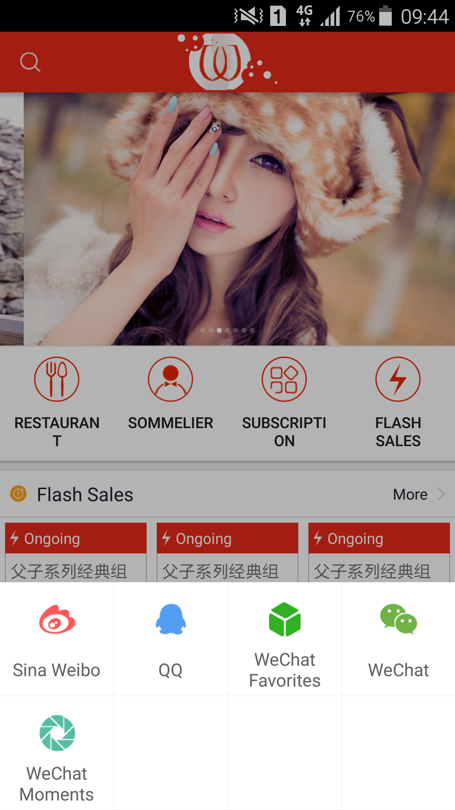
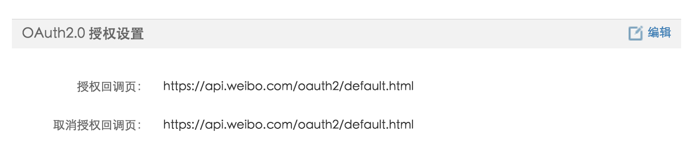
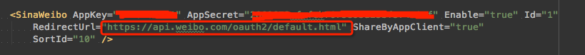

# Mob-Share-SDK
##前言
###这是Mob-Share SDK(一个社会化分享组件)Android Studio版本

Mob官方社会化分享库还是eclipse，我把项目转成gradle项目（Android Studio项目）给大家，方便大家使用，不用自己再转了

本篇文章是参照[博文](http://www.cnblogs.com/smyhvae/p/4585340.html)进行操作的，亲测有效！

##步骤
###1、导入两个module
***注意：***有两个lib都需要导入：

- onekeyshare
- mainlibs

其中您的项目只要引用onekeyshare项目就可以了

###2、在app module(就是入口module中）assets中导入ShareSDK.xml
这个ShareSDK.xml其实就是配置文件，你想用什么分享的sdk直接在里面配置就行了,注意***AppKey和AppSecret依然是需要自己去各个平台申请的***，
其中新浪还需要配置***RedirectUrl***不然无法正常调起

```

<SinaWeibo
    Id="1"
    SortId="1"
    AppKey="568898243"
    AppSecret="38a4f8204cc784f81f9f0daaf31e02e3"
    RedirectUrl="http://www.mob.com"
    Enable="true" />
                
```
- 其中的SortId是此平台在分享列表中的位置，由开发者自行定义，可以是任何整型数字，数值越大越靠后
- AppKey、AppSecret和RedirectUrl是您在新浪微博上注册开发者信息和应用后得到的信息
- Id是一个保留的识别符，整型，ShareSDK不使用此字段，供您在自己的项目中当作平台的识别符。
- Enable字段表示此平台是否有效，布尔值，默认为true，如果Enable为false，即便平台的jar包已经添加到应用中，平台实例依然不可获取。

###3微信、易信和支付宝的特殊处理
如果您集成了微信，易信，支付宝还需要添加下面回调的activity处理；

```
<!--微信分享回调 -->
 <activity
     android:name=".wxapi.WXEntryActivity"
     android:theme="@android:style/Theme.Translucent.NoTitleBar"
     android:configChanges="keyboardHidden|orientation|screenSize"
     android:exported="true"
     android:screenOrientation="portrait" /> 
 
<!--易信分享回调 -->
 <activity
     android:name=".yxapi.YXEntryActivity"
     android:theme="@android:style/Theme.Translucent.NoTitleBar"
     android:configChanges="keyboardHidden|orientation|screenSize"
     android:exported="true"
     android:screenOrientation="portrait" />
 
 <!-- 支付宝分享回调 -->
<activity
    android:name=".apshare.ShareEntryActivity"
    android:theme="@android:style/Theme.Translucent.NoTitleBar"
    android:configChanges="keyboardHidden|orientation|screenSize"
    android:exported="true"/>

```

###4开始使用
####初始化ShareSDK

```
	ShareSDK.initSDK(this);
```
####开始使用
以下是官网的demo，更多见[这里](官网的示例demo/)

```
OnekeyShare oks = new OnekeyShare();
		oks.setSilent(!showContentEdit);
		if (platformToShare != null) {
			oks.setPlatform(platformToShare);
		}
		//ShareSDK快捷分享提供两个界面第一个是九宫格 CLASSIC  第二个是SKYBLUE
		oks.setTheme(OnekeyShareTheme.CLASSIC);
		// 令编辑页面显示为Dialog模式
		oks.setDialogMode();
		// 在自动授权时可以禁用SSO方式
		oks.disableSSOWhenAuthorize();
		//oks.setAddress("12345678901"); //分享短信的号码和邮件的地址
		oks.setTitle("ShareSDK--Title");
		oks.setTitleUrl("http://mob.com");
		oks.setText("ShareSDK--文本");
		//oks.setImagePath("/sdcard/test-pic.jpg");  //分享sdcard目录下的图片
		oks.setImageUrl(randomPic()[0]);
		oks.setUrl("http://www.mob.com"); //微信不绕过审核分享链接
		//oks.setFilePath("/sdcard/test-pic.jpg");  //filePath是待分享应用程序的本地路劲，仅在微信（易信）好友和Dropbox中使用，否则可以不提供
		oks.setComment("分享"); //我对这条分享的评论，仅在人人网和QQ空间使用，否则可以不提供
		oks.setSite("ShareSDK");  //QZone分享完之后返回应用时提示框上显示的名称
		oks.setSiteUrl("http://mob.com");//QZone分享参数
		oks.setVenueName("ShareSDK");
		oks.setVenueDescription("This is a beautiful place!");
		// 将快捷分享的操作结果将通过OneKeyShareCallback回调
		//oks.setCallback(new OneKeyShareCallback());
		// 去自定义不同平台的字段内容
		//oks.setShareContentCustomizeCallback(new ShareContentCustomizeDemo());
		// 在九宫格设置自定义的图标
		 Bitmap logo = BitmapFactory.decodeResource(context.getResources(), R.drawable.ic_launcher);
		 String label = "ShareSDK";
		 OnClickListener listener = new OnClickListener() {
		 	public void onClick(View v) {

		 	}
		 };
		 oks.setCustomerLogo(logo, label, listener);

		// 为EditPage设置一个背景的View
		//oks.setEditPageBackground(getPage());
		// 隐藏九宫格中的新浪微博
		// oks.addHiddenPlatform(SinaWeibo.NAME);

		// String[] AVATARS = {
				// 		"http://99touxiang.com/public/upload/nvsheng/125/27-011820_433.jpg",
				// 		"http://img1.2345.com/duoteimg/qqTxImg/2012/04/09/13339485237265.jpg",
				// 		"http://diy.qqjay.com/u/files/2012/0523/f466c38e1c6c99ee2d6cd7746207a97a.jpg",
				// 		"http://diy.qqjay.com/u2/2013/0422/fadc08459b1ef5fc1ea6b5b8d22e44b4.jpg",
				// 		"http://img1.2345.com/duoteimg/qqTxImg/2012/04/09/13339510584349.jpg",
				// 		"http://diy.qqjay.com/u2/2013/0401/4355c29b30d295b26da6f242a65bcaad.jpg" };
				// oks.setImageArray(AVATARS);              //腾讯微博和twitter用此方法分享多张图片，其他平台不可以

		// 启动分享
		oks.show(context);
```
##成功案例
###看最下面就是集成成功的案例（我只加了微信、qq和微博）

因为我手机语言是英文，所以会显示英文

##常见的坑
####1、新浪微博始终无法正常调起，报4000错误
需要填入:https://api.weibo.com/oauth2/default.html

在新浪微博开发平台后台里面设置

然后在ShareSDK.xml中配置：


####2、无法加入短信分享的问题

####3、附上申请地址列表
```
新浪微博        http://open.weibo.com
腾讯微博        http://dev.t.qq.com
QQ空间          http://connect.qq.com/intro/login/
微信好友        http://open.weixin.qq.com
Facebook       https://developers.facebook.com
Twitter        https://dev.twitter.com
人人网          http://dev.renren.com
开心网          http://open.kaixin001.com
搜狐微博        http://open.t.sohu.com
网易微博        http://open.t.163.com
豆瓣           http://developers.douban.com
有道云笔记      http://note.youdao.com/open/developguide.html#app
印象笔记        https://dev.evernote.com/
Linkedin       https://developer.linkedin.com
FourSquare     https://developer.foursquare.com/
搜狐随身看      https://open.sohu.com/
Flickr         http://www.flickr.com/services/
Pinterest      http://developers.pinterest.com/
Tumblr         http://www.tumblr.com/developers
Dropbox        https://www.dropbox.com/developers
Instagram      http://instagram.com/developer#
VKontakte      http://vk.com/dev
易信好友        http://open.yixin.im/
明道	           http://open.mingdao.com/
Line           http://media.line.me/zh-hant/
Pocket         http://getpocket.com/developer/apps/new
KakaoTalk      https://developers.kakao.com/
KakaoStory     https://developers.kakao.com/

```

4、更多常见问题

[点击这里跳转](http://bbs.mob.com/forum.php?mod=viewthread&tid=30&extra=page%3D1)

##关于我
###LiuTaw,安卓开发者,苏州
###[更多文章，LiuTaw的安卓踩坑之旅](http://liutaw.github.io)

> 作者：刘涛，版权声明：自由转载-非商用-非衍生-保持署名|[Creative Commons BY-NC-ND 4.0](url:http://creativecommons.org/licenses/by-nc-sa/4.0/)